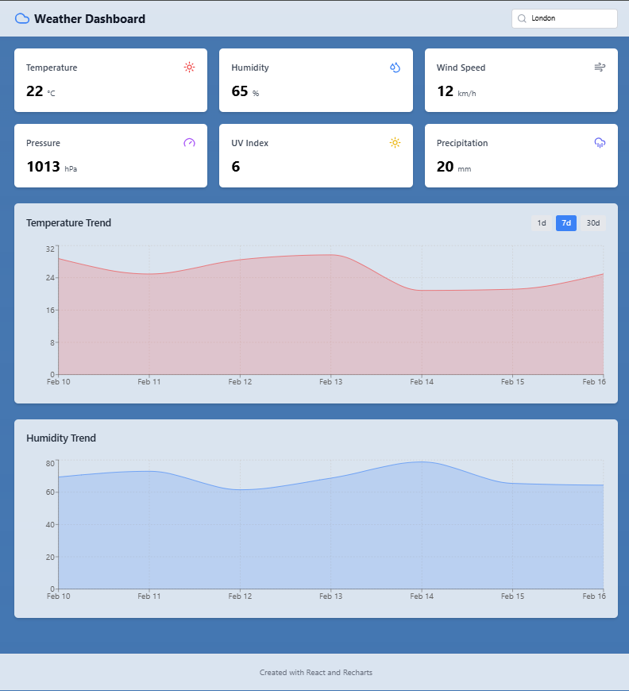

# Weather App 🌦️  

  

## Description 📌  
This is a **basic React + TypeScript application** that fetches weather data from an API and displays it in a user-friendly interface.  

## Installation & Setup 🚀  
To run this project locally, follow these steps:  

1️⃣ Clone the repository:  
```bash
git clone https://github.com/SoufianeElghazi/weather-project.git
```
2️⃣ Navigate to the project directory:
```bash
cd weather-project
```
3️⃣ Install dependencies:
```bash
npm install
```

4️⃣ Start the development server:
```bash
npm run dev
```
The app will now be accessible at http://localhost:5173/ in your browser. 🎉